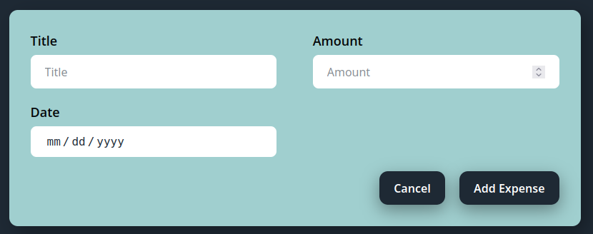
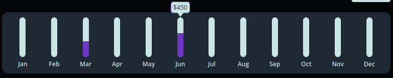
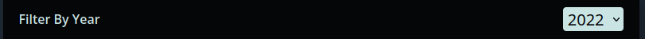
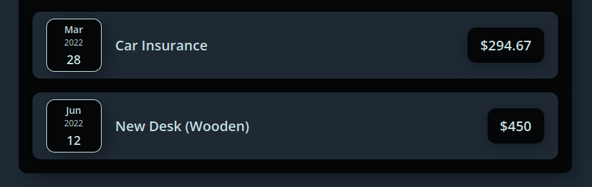
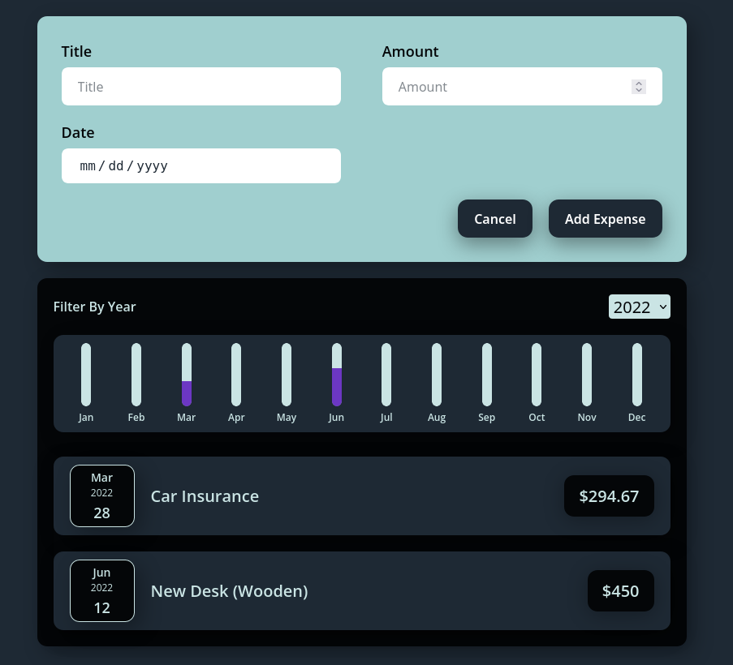

# Expense Tracker with ReactJS

This was my first project with reactjs. This a basic expense tracker app which has an add, filter and showcase expenses by year.

## What Did I Learned?

- Create a project with create-react-app.
- Component concept of react.
- Declarative approach of writting code in react.
- JSX.
- Props.
- Modularizing.
- State of components in react.
- Events and event handling.
- Working with multiple states of same react componenet.
- User input and form submission.
- Lifting state up.
- Dynamically render components.
- Conditional rendering.
- Scoping css classes.

## Features of this Expense tracker

1. Add new expense.
   
2. View visual cost representation of each month.
   
3. Filter by year.
   
4. View expenses by year.
   

### Preview

## How to preview this in your browser?

1. Download/clone this repository.
2. Run the following commands inside the downloaded folder.
   `npm install`
   `npm start`
